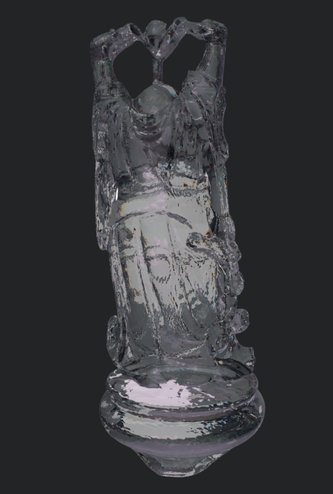

# Webgl Renderer
This is a renderer that supports opening .obj files. You can choose any marterials and render a image.
https://yangshuzhan.github.io/webgl-renderer/

# Current Feature
The following features are supported:

Environmental map

PBRT Materials

Transparent Material

Dispersion

Anti-aliasing

light tracing(metropolis)

# Custorm Shader
You can simply rewrite default.frag/default.frag to create your own shader.

